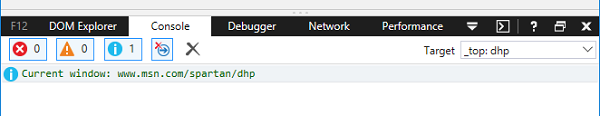

### Google Chrome
Click the three dots on the far right of the address bar, then click **More tools** > **Developer tools**.

### Microsoft Internet Explorer / Edge
Press **F12** and then click on the tab labelled **console**

### Safari
In the top menu, click on **Develop** > **Show Error Console**. If your menu does not have **Develop** on it, enable the developer tools by clicking on **Safari** > **Preferences** and then on the **Advanced** tab. There, tick the box labelled **Show Develop menu in menu bar**.
